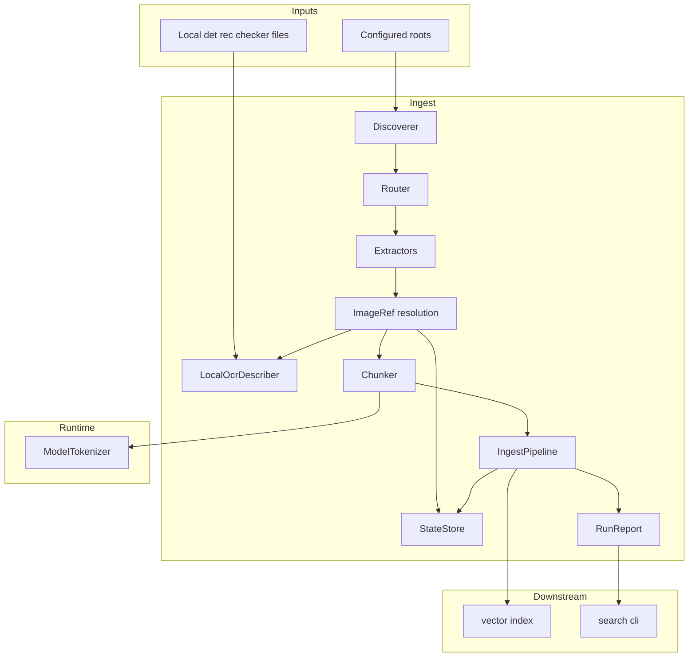
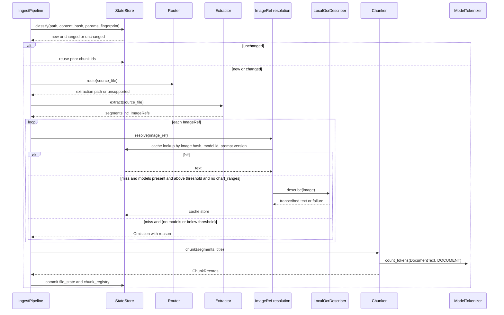
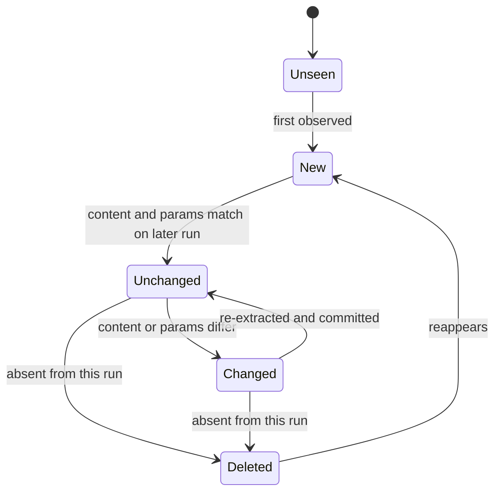

# Technical Design: document-ingest

## Overview

**Purpose**: This feature turns a heterogeneous local archive — Markdown, plain text, PDF, Excel financial models and several thousand chart images — into chunk records that fit the embedding runtime's 512-token input, carry enough provenance to be cited and re-found, and can be regenerated cheaply as the archive grows.

**Users**: The archive owner runs it on demand after new files arrive. `vector-index` consumes its records; `search-cli` surfaces its run report.

**Impact**: Greenfield. It adds a sibling package `npu_rag.ingest` beside the closed `npu_rag.embedding` runtime and consumes that runtime's tokenizer and text types as a library. Image-to-text is local det+rec OCR in `vision.py`. There is no outbound network call.

### Goals
- One call walks configured roots and yields embedding-ready `ChunkRecord`s with a stable identity and a source locator on every record.
- Extraction is routed by inspected content so OCR is used only for images and textless pages.
- Spreadsheets are chunked by labelled block with their labels and period headers intact; values and formulas are both searchable.
- A re-run with nothing changed extracts nothing, calls nothing and says so.
- The pipeline is complete with no NPU, no network and no OCR models; what it cannot do is reported by path and reason. It never invents a number.

### Non-Goals
- Producing vectors, storing chunks or vectors, choosing the token budget, or deciding which tokenizer is authoritative — all owned upstream or downstream.
- A local OCR or layout model stack (evaluated and rejected; see `research.md`).
- Any hosted call. A daemon or file watcher. Near-duplicate detection across files. DeepDoc layout/TSR. NPU compile of OCR.
- Reading-order recovery for multi-column PDF text layers; the vision route is the remedy if it proves material.

## Boundary Commitments

### This Spec Owns
- Discovery under configurable roots, include/exclude filtering, and de-duplication across overlapping roots.
- Routing each file to an extraction path by type **and** inspected content, including the per-page text-layer decision inside PDFs.
- Extraction for Markdown, plain text, PDF, Excel workbooks and standalone raster images, each behind the one `Extractor` protocol, each emitting the one `Segment` vocabulary.
- The image-to-text seam: size threshold, result cache, local det+rec OCR with a second-engine vote on numeric tokens, absent-model degradation, native chart ranges indexed without OCR, and provenance marking of everything OCR-derived.
- Token-budget chunking against the runtime's tokenizer, the per-kind overlap policy, heading-aware splitting, and block splitting with repeated headers.
- Chunk identity and per-file state: content and parameter fingerprints, new/changed/unchanged/deleted classification, the chunk registry that makes deletions reportable, and the vision cache.
- Per-file failure isolation and the run report.
- The `IngestConfig` contract and the `ChunkRecord` / `RunReport` output contracts that `vector-index` and `search-cli` build against.

### Out of Boundary
- Embedding, vector storage, retrieval — `npu-embedding-runtime`, `vector-index`.
- The value of the token budget and the tokenizer itself — supplied by the runtime via `ModelTokenizer`; never re-implemented or approximated here.
- Acquiring, scraping or modifying source documents; the archive is read-only to this feature.
- Choosing or benchmarking OCR models beyond the InfiniFlow det+rec pair and the Tesseract digit checker; identities are configuration.
- Removing records from any downstream store on deletion. This feature **reports** removed chunk ids (8.4); `vector-index` acts on them.
- Any second spreadsheet reader, DeepDoc layout/TSR, hosted image-to-text, figure captioning.

### Allowed Dependencies
- `npu_rag.embedding` — `ModelTokenizer` (`.tokenize`), `DocumentText` and `TextKind` (`.types`), `MISSING_TITLE_SENTINEL` (`.profiles`), and `find_dotenv`, `parse_dotenv`, `REDACTED` (`.models.acquire`). The runtime's package root exports nothing, so these are imported by submodule path. `models.acquire` imports `huggingface_hub` at module scope; that transitive import is **accepted** — it issues no request at import time, and the tokenizer the caller hands in is loaded through the same module regardless. This is the intended direction; the runtime's own guard forbids the reverse and stays untouched.
- Standard library: `sqlite3`, `hashlib`, `pathlib`, `json`, `base64`, `concurrent.futures`.
- Third-party, declared in `[project]`: `markdown-it-py`, `openpyxl`, `pypdfium2`, `pillow`, `onnxruntime` (already present for embedding). OCR models are files on disk (`InfiniFlow/deepdoc` `det.onnx` + `rec.onnx`), not a Python package import of RAGFlow. Tesseract 5 is a local binary consulted only as the digit checker.
- Network: **no module may open a connection.** The layer guard asserts that `httpx` is imported nowhere under `npu_rag.ingest`. `huggingface_hub` remains an accepted transitive import of the runtime's acquire module at import time, issuing no request.
- Constraint: modules import only leftward along the dependency direction below; `extract/*` may not import `vision`; nothing imports `pipeline` except the caller.

### Revalidation Triggers
- `ChunkRecord` or `ChunkKind` changes shape or gains a member → `vector-index` must re-check its schema and its per-kind handling.
- `RunReport` or `Omission` changes shape → `search-cli` must re-check its rendering.
- The runtime changes `ModelTokenizer.count_tokens`, the document template, or the compiled length → requirement 6.7's contract test must be re-run and `params_fingerprint` inputs re-checked.
- The OCR pipeline version (detector, recognizer or digit-checker identity) changes → every cached result is invalidated by design; the owner must expect a full OCR re-run over affected images.
- A sixth chunk kind or a fifth extractor is added → the layer guard's `LAYER_ORDER` and the no-overlap policy table must be updated together.

## Architecture

### Architecture Pattern & Boundary Map

A staged pipeline in the runtime's ports-and-adapters style. Extractors are adapters behind one protocol and never touch the network; the pipeline is the single place every stage meets and the single place per-file isolation is enforced.



**Architecture Integration**:
- Selected pattern: staged pipeline with per-format adapters; one `ImageRef` seam for all four image producers.
- Domain boundaries: extraction is pure and offline; resolution owns cache, model presence and OCR; chunking owns the budget; state owns persistence; the pipeline owns sequencing and isolation.
- Existing patterns preserved: errors carrying a `stage`; omissions carrying a reason and never a substituted value; a package-wide layer guard. Hosted credentials are withdrawn.
- Steering compliance: uv-managed Python 3.12, lean default dependencies, Windows-first paths, no NPU or network required to run.

**Dependency direction** (each module imports only from modules to its left; enforced by a guard test):

```
types, errors → config → credential → identity → state → discover → route → extract → vision → chunk, report → pipeline
```

### Technology Stack

| Layer | Choice / Version | Role in Feature | Notes |
|-------|------------------|-----------------|-------|
| Language / runtime | Python 3.12, uv | as the rest of the project | no conda, PowerShell tooling |
| Markdown | `markdown-it-py` 4.2 | token stream with line provenance; headings, tables, image refs | already installed transitively; declare explicitly |
| PDF | `pypdfium2` 5.13 | per-page text probe and extraction; page rasterisation for the vision path | one dependency for both jobs; `pdfplumber` rejected |
| Spreadsheets | `openpyxl` 3.1.5 | cells, merged ranges, hidden sheets, formulas; anchored images and chart source ranges via one adapter over private attributes | two loads per workbook; `calamine` dropped |
| Images | `pillow` | dimensions for the size threshold; raster for OCR | already added |
| OCR | InfiniFlow `det.onnx` + `rec.onnx` on CPU ONNX Runtime; Tesseract 5 LSTM as digit checker | transcribe visible text; second vote on numeric tokens | Apache-2.0 models; no PaddlePaddle; no HTTP |
| State / cache | stdlib `sqlite3` | file state, chunk registry, vision cache in one file | transactional per file; no dependency |
| Tokenizer | `npu_rag.embedding.tokenize.ModelTokenizer` | every chunk measurement | never approximated |

## File Structure Plan

### Directory Structure
```
src/npu_rag/ingest/
├── __init__.py            # Public surface: run_ingest, IngestConfig, ChunkRecord, RunReport
├── types.py               # SourceFile, Locator kinds, Segment kinds incl. ImageRef, ChunkKind, ChunkRecord, Omission, RunReport
├── errors.py              # IngestError taxonomy with stage and path: DiscoveryError, ExtractionError, VisionError, StateError
├── config.py              # IngestConfig: roots, include/exclude, token budget, overlap, thresholds, model id, prompt version, state path
├── credential.py          # withdrawn 2026-09-10; OpenRouterCredential must not be consulted; removal is a later cleanup
├── identity.py            # params_fingerprint, file content hash, chunk_id derivation
├── state.py               # StateStore over sqlite3: file_state, chunk_registry, vision_cache; classification queries
├── discover.py            # Discoverer: walk roots with long-path support, include/exclude, de-dup across overlapping roots, author from directory
├── route.py               # SourceFile -> ExtractionPath by extension plus content sniff; unsupported types recorded
├── extract/
│   ├── __init__.py
│   ├── base.py            # Extractor protocol, Extracted result, shared normalisation helpers
│   ├── markdown.py        # markdown-it-py: front matter, HTML, headings, tables, ImageRef anchors
│   ├── text.py            # plain text
│   ├── pdf.py             # pypdfium2: per-page text or ImageRef of the rendered page; page locators
│   ├── excel.py           # openpyxl: blank-row blocks, merged-cell attribution, values+formulas, hidden sheets, charts and images adapter
│   └── image.py           # standalone raster file -> one ImageRef with dimensions
├── vision.py              # VisionDescriber protocol; LocalOcrDescriber (det+rec); numeric agreement with Tesseract; cache-through via StateStore; PIPELINE_VERSION
├── chunk.py               # Chunker over ModelTokenizer: budget, per-kind overlap, heading-aware split, block split with repeated header
├── report.py              # RunReport counting and human-readable rendering
└── pipeline.py            # IngestPipeline: discover -> route -> extract -> resolve ImageRefs -> chunk -> persist -> report; per-file isolation

tests/ingest/
├── test_package_baseline.py   # layer guard for npu_rag.ingest; extract/* may not import vision; httpx imported nowhere under ingest
├── test_types.py, test_errors.py, test_config.py, test_credential.py, test_identity.py, test_state.py, test_discover.py, test_route.py, test_report.py
├── extract/test_markdown.py, test_text.py, test_pdf.py, test_excel.py, test_image.py
├── test_vision.py             # fake describer; LocalOcrDescriber over committed ONNX fixtures; numeric agreement; chart_ranges skip OCR
├── test_chunk.py              # budget, overlap policy, heading split, block split; measured with the title attached
├── conftest.py                # the offline tokenizer fixture: a real, ungated tokenizer loaded from committed files, never from the network
├── test_pipeline.py           # per-file isolation and the entry point
├── test_incremental.py        # no-op re-run, deletion reporting, parameter reclassification
├── test_offline.py            # absent OCR models, zero network requests, no runtime provider imports
├── test_failure_isolation.py  # a mixed root of corrupt files; an all-bad root
├── test_token_contract.py     # requirement 6.7 both ways; unconditional against the offline tokenizer, opt-in against the gated default
└── fixtures/
    ├── tokenizer/             # committed tokenizer files for gte-modernbert-base, Apache-2.0 and ungated, so 6.7 can never skip
    ├── markdown/              # front matter, HTML, tables, images with and without alt text
    ├── pdf/                   # a text-layer page and a textless page
    ├── excel/                 # models.xlsx built by a committed generator: blank-row blocks, a merged label spanning rows, formulas with and without cached values, a hidden sheet, one chart, one image
    └── images/                # a chart above the threshold and an icon below it
```
*(Test layout corrected 2026-09-08 at task planning: the four pipeline-level concerns were one file, which made their tasks unsafe to run in parallel; and the 6.7 contract test had no tokenizer it could run against offline — every real tokenizer in the runtime's suite sits behind a network-gated skip.)*
```
```

### Modified Files
- `pyproject.toml` — add `openpyxl`, `pypdfium2`, `pillow` to `[project] dependencies`; declare `httpx` and `markdown-it-py` explicitly there (currently transitive only). No new group; nothing here is heavyweight.
- `.gitignore` — the default state path `.npu_rag/ingest.sqlite`.
- `tests/embedding/test_package_baseline.py` — **unchanged**; it forbids `embedding` importing siblings, which this design respects.

## System Flows

One file through the pipeline, showing where the paid path is gated:



Flow-level decisions: classification happens before any extraction, so an unchanged file costs one hash and one query. Image resolution is the only stage that runs OCR and it is gated by threshold, native chart ranges, cache, and model presence before a session is opened. The per-file `commit` is atomic, so a crash mid-run leaves every completed file consistent and every incomplete file classified as new on the next run.

File classification is a small state machine:



## Requirements Traceability

| Requirement | Summary | Components | Interfaces | Flows |
|-------------|---------|------------|------------|-------|
| 1.1, 1.2, 1.3 | roots as config, recursive walk, include/exclude | `IngestConfig`, `Discoverer` | `Discoverer.discover` | — |
| 1.4 | unreadable root reported, run continues | `Discoverer`, `RunReport` | `Omission(category=ROOT_UNAVAILABLE)` | — |
| 1.5 | long and non-ASCII paths | `Discoverer`, `SourceFile` | `\\?\` prefixed absolute paths on Windows | — |
| 1.6 | overlapping roots de-duplicated | `Discoverer` | de-dup by resolved absolute path | — |
| 2.1 | route by type and inspected content | `Router` | `Router.route` | sequence |
| 2.2, 2.3, 2.5 | per-page text-layer threshold | `PdfExtractor`, `IngestConfig.min_page_chars` | emits `ProseSegment` or `ImageRef` per page | sequence |
| 2.4 | unsupported type recorded | `Router`, `RunReport` | `Omission(category=UNSUPPORTED)` | — |
| 3.1, 3.5 | Markdown cleaned, headings kept, title recorded | `MarkdownExtractor` | `Extracted.title`, `ProseSegment.heading_path` | — |
| 3.2 | image reference kept as anchor | `MarkdownExtractor` | `ImageRef.locator = MarkdownLocator(line_range, ordinal)` | — |
| 3.3 | Unicode and whitespace normalisation | `extract/base.normalise` | pure function | — |
| 3.4 | reading order within a page | `PdfExtractor` | content-stream order; limitation recorded | — |
| 4.1 | blank-row runs bound blocks | `ExcelExtractor` | `segment_blocks` | — |
| 4.2, 4.3 | label and header carried; oversize block split with header repeated | `ExcelExtractor`, `Chunker` | `BlockSegment`; `Chunker.split_block` | — |
| 4.4, 4.5 | value in block, formula as its own kind; unavailable value reported | `ExcelExtractor` | two loads; `FormulaSegment`; `Omission(category=VALUE_UNAVAILABLE)` | — |
| 4.6 | embedded charts and images routed to vision | `ExcelExtractor` | `ImageRef` from the anchored-object adapter | sequence |
| 4.7 | chart source ranges read directly | `ExcelExtractor` | `ChartRanges` on the `ImageRef` | — |
| 4.8 | hidden sheets skipped and named | `ExcelExtractor` | `Omission(category=HIDDEN_SHEET)` | — |
| 5.1 | OCR result emitted as a distinct kind with its image reference | ImageRef resolution, `Chunker` | `FigureSegment` → `ChunkKind.FIGURE` | sequence |
| 5.2 | models absent: skip and report by path and count | ImageRef resolution, `RunReport` | `Omission(category=VISION_UNAVAILABLE)` | sequence |
| 5.3 | size threshold, count reported | ImageRef resolution, `IngestConfig.min_image_pixels` | `Omission(category=BELOW_THRESHOLD)`, counted | sequence |
| 5.4, 5.5 | cache by image, recognizer id, pipeline version; hit runs no OCR | `StateStore.vision_cache`, ImageRef resolution | `StateStore.cached_description` | sequence |
| 5.6 | OCR failure recorded, run continues | `LocalOcrDescriber` | `VisionError` → `Omission(category=VISION_FAILED)` | sequence |
| 5.7 | detector, recognizer, checker ids are configuration | `IngestConfig` | — | — |
| 5.8 | OCR-derived chunks marked with recognizer id | `ChunkRecord.provenance` | `Provenance` fields reused as recognizer id + pipeline version | — |
| 5.9 | numeric tokens kept only when both local engines agree | `LocalOcrDescriber` | disagreed digits omitted | sequence |
| 5.10 | native chart ranges are the figure text; no OCR | ImageRef resolution | `chart_ranges` short-circuit | sequence |
| 6.1, 6.2, 6.3 | budget is input; runtime tokenizer; never over budget | `Chunker` | `Chunker.__init__(tokenizer, budget)`; `count_tokens(DocumentText, DOCUMENT)` | sequence |
| 6.4, 6.5 | overlap on prose only | `Chunker` | `OVERLAP_POLICY: dict[ChunkKind, bool]` | — |
| 6.6 | heading-aware split | `Chunker` | splits at `heading_path` change first | — |
| 6.7 | two-way agreement with the runtime's truncation | `test_token_contract.py` | `count_tokens` vs `encode_documents().truncated_indices` | — |
| 7.1, 7.2, 7.3 | path, kind, position, author, locator on every chunk | `ChunkRecord`, `Discoverer` (author) | `Locator` union | — |
| 7.4, 7.5 | stable identity | `identity.chunk_id` | hash of file-local inputs only | — |
| 8.1, 8.2 | persisted state over content plus all output-affecting parameters | `StateStore`, `identity.params_fingerprint` | `file_state` table | state |
| 8.3 | unchanged file reused, not re-extracted | `IngestPipeline`, `StateStore` | `classify` before extract | sequence |
| 8.4 | deleted files' records reported as removed | `StateStore.chunk_registry`, `RunReport` | `RunReport.removed_chunk_ids` | state |
| 8.5 | parameter change reclassifies as changed | `identity.params_fingerprint` | fingerprint compared in `classify` | state |
| 8.6 | no-op re-run: nothing extracted, nothing called, reported | `IngestPipeline`, `RunReport` | `RunReport.no_work_required` | — |
| 9.1 | per-file failure isolated | `IngestPipeline` | catches `IngestError` and `Exception` per file | sequence |
| 9.2, 9.3, 9.4 | counts; skipped and failed listed with reason; missing capability named | `RunReport`, `report.render` | `Omission.reason`, `Omission.missing_capability` | — |
| 9.5 | run completes when every file fails | `IngestPipeline` | report always produced | — |
| 10.1 | no NPU required | whole package | no import of providers or sessions | — |
| 10.2, 10.3 | no network during ingest | layer guard: `httpx` imported nowhere under ingest | `test_package_baseline` | — |
| 10.4 | no hosted-vision credential is read | ingest must not consult `OpenRouterCredential` | — | — |
| 10.5 | absent OCR models degrade to local paths | ImageRef resolution, `LocalOcrDescriber` | `VISION_UNAVAILABLE` naming the missing file | sequence |

## Components and Interfaces

| Component | Domain/Layer | Intent | Req Coverage | Key Dependencies (P0/P1) | Contracts |
|-----------|--------------|--------|--------------|--------------------------|-----------|
| `IngestConfig` | config | every tunable in one frozen object | 1.1, 1.3, 2.5, 5.3, 5.7, 6.1, 6.4 | — | State |
| `OpenRouterCredential` | credential | **withdrawn 2026-09-10** — must not be consulted | — | — | — |
| `Discoverer` | discovery | roots → `SourceFile`s, de-duplicated, author derived | 1.1–1.6, 7.2 | `IngestConfig` (P0) | Service |
| `Router` | routing | `SourceFile` → extraction path | 2.1, 2.4 | — | Service |
| `Extractor` protocol + 5 adapters | extraction | file → `Extracted` segments, offline | 2.2, 2.3, 3.x, 4.x | `pypdfium2`, `openpyxl`, `markdown-it-py` (P0) | Service |
| ImageRef resolution | vision seam | gate, cache, describe, mark | 5.1–5.6, 5.8, 10.5 | `StateStore`, `VisionDescriber` (P0) | Service |
| `LocalOcrDescriber` | vision adapter | det+rec on CPU plus digit checker | 5.1, 5.6, 5.9, 10.2, 10.3, 10.5 | InfiniFlow ONNX (P1), Tesseract (P1) | Service |
| `Chunker` | chunking | segments → `ChunkRecord`s within budget | 4.2, 4.3, 6.1–6.6 | `ModelTokenizer` (P0) | Service |
| `identity` | identity | fingerprints and chunk ids | 7.4, 7.5, 8.2, 8.5 | — | Service |
| `StateStore` | persistence | file state, chunk registry, vision cache | 5.4, 5.5, 8.1–8.5 | `sqlite3` (P0) | State |
| `IngestPipeline` | orchestration | sequencing, isolation, report | 8.3, 8.6, 9.1–9.5 | all of the above (P0) | Batch |
| `RunReport` / `report` | reporting | counts, omissions, removed ids | 1.4, 2.4, 5.2, 5.3, 9.2–9.4 | — | State |

### Extraction

#### `Extractor` protocol and the five adapters

| Field | Detail |
|-------|--------|
| Intent | Turn one `SourceFile` into an ordered list of `Segment`s without touching the network or the state store |
| Requirements | 2.2, 2.3, 3.1–3.5, 4.1–4.8 |

**Responsibilities & Constraints**
- Pure with respect to the outside world: reads the file, returns segments, raises `ExtractionError` with a `stage` and the path on failure. Never imports `vision`, `state` or `httpx` (guarded).
- Emits `ImageRef` for anything that needs image-to-text; never decides whether that will happen.
- `PdfExtractor` applies `min_page_chars` per page: at or above → `ProseSegment(page=n)`; below → `ImageRef(locator=PageLocator(n), bytes=rendered PNG)`.
- `ExcelExtractor` loads twice (values, then formulas); segments blocks by blank-row runs with merged-cell attribution; emits `BlockSegment`, `FormulaSegment`, `ImageRef` for anchored images and charts, and `Omission`s for hidden sheets and unavailable values. All access to `ws._images` / `ws._charts` lives in one function, `anchored_objects(ws)`, with a committed fixture as its smoke test.
- `MarkdownExtractor` uses the token stream: front matter and HTML blocks dropped; headings maintain a `heading_path`; GFM tables become `TableSegment`; image tokens become `ImageRef(locator=MarkdownLocator(line_range, ordinal))` and are resolved from the file's directory.

**Dependencies**
- Inbound: `IngestPipeline` — calls `extract` (P0)
- Outbound: `extract/base.normalise` (P0); `IngestConfig` thresholds (P0)
- External: `pypdfium2`, `openpyxl`, `markdown-it-py`, `pillow` (P0)

**Contracts**: Service [x]

##### Service Interface
```python
class Extractor(Protocol):
    def extract(self, source: SourceFile, config: IngestConfig) -> Extracted: ...

@dataclass(frozen=True)
class Extracted:
    title: str | None
    segments: tuple[Segment, ...]      # in reading order
    omissions: tuple[Omission, ...]    # hidden sheets, unavailable values

Segment = ProseSegment | TableSegment | BlockSegment | FormulaSegment | ImageRef
```
- Preconditions: `source.path` exists and `Router` selected this extractor.
- Postconditions: segments are in reading order; every segment carries a `Locator`; no segment text contains front matter, HTML, or image syntax.
- Invariants: no network; no state; an `ImageRef` carries raw bytes, MIME, width and height, so resolution needs nothing from the extractor afterwards.

**Implementation Notes**
- Integration: `BlockSegment` carries `label`, `header_row: tuple[str, ...]`, `rows: tuple[tuple[str, ...], ...]` with the row label as column 0, so the chunker can split and re-head it without re-parsing.
- Validation: the Excel fixture must contain a merged label spanning rows, so a naive "all cells `None`" rule is proven wrong by a test; the PDF fixture needs one textless page so the threshold branch is reachable.
- Risks: openpyxl private attributes; multi-column PDF ordering (accepted, recorded).

### Vision seam

#### ImageRef resolution and `LocalOcrDescriber`

| Field | Detail |
|-------|--------|
| Intent | Replace each `ImageRef` with a `FigureSegment` or an `Omission` by transcribing visible text locally, never by describing or guessing |
| Requirements | 5.1–5.10, 10.1–10.5 |

**Responsibilities & Constraints**
- Resolution order per `ImageRef`: threshold (5.3) → `chart_ranges` present (5.10) → cache (5.5) → models present (5.2) → describe (5.1, 5.9) → cache store (5.4). Each refusal is an `Omission` with its own category.
- Where `chart_ranges` is set, emit figure text from those ranges and **do not** run OCR. Native Excel charts have exact ranges and no usable raster.
- `LocalOcrDescriber` loads InfiniFlow `det.onnx` and `rec.onnx` through ONNX Runtime **CPU**. It never imports `httpx`. It never opens a socket. Missing model files raise `VisionUnavailable` for the rest of the run.
- After recognition, numeric tokens (integers, decimals, percentages, currency amounts) are kept only when Tesseract 5 LSTM, run on the same crop, produces the same normalised digits (5.9). A number seen in only one engine is dropped. If that emptying leaves no text, the image is `Omission(NUMERIC_DISAGREED)` (new category on `OmissionCategory`, added in task 5.1). Non-numeric text from the primary recognizer may remain.
- The describer handles **one image per call**. `resolve_all` owns the bounded pool (`vision_concurrency`, default 4).
- `Provenance.vision_model` is the primary recognizer id. `Provenance.prompt_version` is the OCR pipeline version string (det + rec + checker). The field name is kept so `ChunkRecord` JSON from task 1.2 does not change shape.

**Dependencies**
- Inbound: `IngestPipeline` (P0)
- Outbound: `StateStore.vision_cache` (P0), `IngestConfig` (P0)
- External: InfiniFlow DeepDoc ONNX files (P1 — optional, degradable); Tesseract 5 binary (P1 — optional, degradable)

**Contracts**: Service [x]

##### Service Interface
```python
class VisionDescriber(Protocol):
    def describe(self, image: ImageRef) -> str: ...     # raises VisionError; raises VisionUnavailable if models absent

@dataclass(frozen=True)
class Resolved:
    figure: FigureSegment | None
    omission: Omission | None                            # exactly one of the two is set

def resolve(ref: ImageRef, *, store: StateStore, describer: VisionDescriber | None,
            config: IngestConfig) -> Resolved: ...

def resolve_all(refs: Sequence[ImageRef], *, store: StateStore, describer: VisionDescriber | None,
                config: IngestConfig) -> tuple[Resolved, ...]: ...
```
- Preconditions: `ref.width`/`ref.height` known.
- Postconditions: on success `FigureSegment.provenance` names the recognizer id and pipeline version; on refusal `omission.category` is one of `BELOW_THRESHOLD`, `VISION_UNAVAILABLE`, `VISION_FAILED`, `NUMERIC_DISAGREED`.
- Invariants: a cache hit never constructs an ORT session; `describer is None` never raises; no HTTP client is constructed anywhere.

**Implementation Notes**
- Integration: no chat prompt. Pipeline version is a module constant derived from the three engine identities; changing an engine without bumping it is a review failure.
- Validation: committed tiny ONNX fixtures or fakes for det/rec; a planted numeric disagreement drops the digits; a chart `ImageRef` with `chart_ranges` never calls the describer; a run with models absent names the missing capability; a failing transport's request counter stays zero.
- Risks: Tesseract must be provisioned as a local binary; if it is absent, OCR is unavailable rather than running single-engine on numbers. NPU compile of `det` is out of this spec.

### Chunking

#### `Chunker`

| Field | Detail |
|-------|--------|
| Intent | Turn segments into `ChunkRecord`s that the runtime will accept unmodified |
| Requirements | 4.2, 4.3, 6.1–6.6 |

**Responsibilities & Constraints**
- Measures **every** candidate as `tokenizer.count_tokens(DocumentText(content=text, title=title), TextKind.DOCUMENT)` — with the document title attached, because the runtime counts over the rendered template and a titled document costs more than its content.
- Prose: accumulate paragraphs up to the budget, splitting at a `heading_path` change first (6.6); apply `prose_overlap_tokens` between consecutive prose chunks (6.4). Tables, blocks, formulas, figures: one segment → one or more chunks, never overlapping (6.5).
- Blocks over budget are split by rows with `label` and `header_row` repeated in every piece (4.3).
- A single indivisible unit over budget (one paragraph, one table row) is truncated at a token boundary and the chunk marked `truncated=True`, so 6.3 holds without silently dropping content.

**Dependencies**
- Inbound: `IngestPipeline` (P0)
- Outbound: `identity.chunk_id` (P0)
- External: `ModelTokenizer` from the runtime (P0)

**Contracts**: Service [x]

##### Service Interface
```python
class Chunker:
    def __init__(self, tokenizer: ModelTokenizer, *, budget: int, prose_overlap_tokens: int) -> None: ...
    def chunk(self, source: SourceFile, extracted: Extracted, *, params: ParamsFingerprint) -> tuple[ChunkRecord, ...]: ...

OVERLAP_POLICY: Final[dict[ChunkKind, bool]] = {
    ChunkKind.PROSE: True, ChunkKind.TABLE: False, ChunkKind.BLOCK: False,
    ChunkKind.FORMULA: False, ChunkKind.FIGURE: False,
}
```
- Preconditions: `budget == tokenizer.max_input_tokens` is asserted at construction — a mismatch is a configuration error, not something to reconcile silently.
- Postconditions: every record satisfies `tokenizer.exceeds_limit(DocumentText(record.text, record.title), DOCUMENT) is False`.
- Invariants: `OVERLAP_POLICY` covers every `ChunkKind` member (pinned by test, so a sixth kind cannot be added without deciding its policy).

### Persistence

#### `StateStore`

| Field | Detail |
|-------|--------|
| Intent | Make incremental re-runs and cache hits possible with one file and no dependency |
| Requirements | 5.4, 5.5, 8.1–8.5 |

**Contracts**: State [x]

##### State Management
- State model: three tables in one SQLite file — `file_state(root_id, relative_path, content_hash, params_fingerprint, status, last_seen_run)`, `chunk_registry(chunk_id, root_id, relative_path, record_json)`, `vision_cache(image_sha256, model_id, prompt_version, text, created_at)`. *(Corrected 2026-09-08 at task planning: the registry originally held ids only, which made requirement 8.3's "reuse the previously emitted records" impossible — an unchanged file could contribute ids but not records. The full `ChunkRecord` is now persisted as JSON, so an unchanged file is re-emitted from the store without extraction. This feature still stores no vectors.)*
- Persistence & consistency: one transaction per file covering `file_state` and its `chunk_registry` rows; a run id stamps `last_seen_run`, and files whose `last_seen_run` is older than the current run at the end are the deleted set (8.4).
- Concurrency strategy: single writer; the vision cache is read and written under the same connection from the describer's worker threads via a lock. Two simultaneous ingest processes are unsupported and detected by SQLite's lock.

##### Service Interface
```python
class StateStore:
    def classify(self, file: SourceFile, content_hash: str, params: ParamsFingerprint) -> FileStatus: ...
    def commit_file(self, file: SourceFile, content_hash: str, params: ParamsFingerprint, records: Sequence[ChunkRecord], run_id: str) -> None: ...
    def records_for(self, file: SourceFile) -> tuple[ChunkRecord, ...]: ...   # an unchanged file's retained records, re-emitted without extraction (8.3)
    def deleted_since(self, run_id: str) -> tuple[tuple[SourceFile, tuple[str, ...]], ...]: ...
    def cached_description(self, image_sha256: str, model_id: str, prompt_version: str) -> str | None: ...
    def store_description(self, image_sha256: str, model_id: str, prompt_version: str, text: str) -> None: ...
```

### Orchestration

#### `IngestPipeline`

| Field | Detail |
|-------|--------|
| Intent | Run the stages in order for every file, isolate failures, and produce the report |
| Requirements | 8.3, 8.6, 9.1–9.5 |

**Contracts**: Batch [x]

##### Batch / Job Contract
- Trigger: `run_ingest(config: IngestConfig, tokenizer: ModelTokenizer, *, describer: VisionDescriber | None = None) -> RunReport`. The caller passes the runtime's tokenizer; the pipeline builds `LocalOcrDescriber` from configured model paths unless a describer is injected (tests inject a fake). It must not consult `OpenRouterCredential`.
- Input / validation: `IngestConfig` validated at construction; `budget` cross-checked against the tokenizer.
- Output / destination: `RunReport` (counts, omissions, removed chunk ids, `no_work_required`) returned in memory and rendered by `report.render`. `RunReport.records` carries **every current record** — those extracted this run for new and changed files, and those re-emitted from the state store for unchanged files (8.3) — so a consumer can rebuild from one run's output. Vectors are never stored here.
- Idempotency & recovery: a re-run is a no-op for unchanged files by construction; a crash leaves committed files committed and uncommitted files classified as new; the vision cache survives crashes because it commits per image.
- Isolation: each file is wrapped so that `IngestError` and any other `Exception` becomes `Omission(category=FAILED, reason=...)` and the loop continues; `KeyboardInterrupt` propagates.

### Summary-only components
- **`IngestConfig`** — frozen dataclass; `roots: tuple[Path, ...]` (≥1), `include`/`exclude` glob tuples, `token_budget`, `prose_overlap_tokens` (default 64), `min_page_chars` (default 50), `min_image_pixels` (default 200, applied to the shorter side), `ocr_det_path`, `ocr_rec_path`, `ocr_checker` (tesseract binary or `none`), `vision_concurrency` (4), `state_path`. `vision_model` / `vision_base_url` are withdrawn. Validation refuses an empty `roots`, a non-positive budget, or overlap ≥ budget.
- **`OpenRouterCredential`** — **withdrawn 2026-09-10**. The module from task 1.5 remains until cleanup; calling it is a review failure.
- **`Discoverer`** — resolves each root, walks with `\\?\`-prefixed paths on Windows, applies include/exclude, de-duplicates by resolved absolute path, derives `author` as the first directory component beneath the root, and emits an `Omission(ROOT_UNAVAILABLE)` per unreadable root.
- **`Router`** — extension plus a content sniff (PDF magic, zip signature for `.xlsx`, image header via `pillow`); unmatched → `Omission(UNSUPPORTED)`.
- **`identity`** — `params_fingerprint(config, tokenizer_id, extractor_versions)` as a SHA-256 over canonical JSON; `content_hash(path)`; `chunk_id(root_id, relative_path, kind, locator, ordinal, params)`.
- **`report`** — counts by status and category; a human-readable rendering that lists every omission by path and reason and names the missing capability where one applies (9.4).

## Data Models

### Domain Model
- **Aggregate: the source file.** A `SourceFile` and everything derived from it — its `Extracted` segments, its `ChunkRecord`s, its `file_state` row and its `chunk_registry` rows — change together and are committed together. Nothing derived from one file references another.
- **Value objects**: `Locator` (a discriminated union: `MarkdownLocator(line_range, ordinal)`, `PageLocator(page)`, `SheetLocator(sheet, cell_range)`, `ImageFileLocator()`), `Provenance(vision_model, prompt_version)` where those fields mean recognizer id and OCR pipeline version, `ParamsFingerprint`, `ChunkKind` (`PROSE`, `TABLE`, `BLOCK`, `FORMULA`, `FIGURE`), `Omission(category, path, reason, missing_capability)` with `NUMERIC_DISAGREED` added in task 5.1.
- **Invariants**: a `ChunkRecord` has exactly one `Locator`; a `FIGURE` record has a non-`None` `Provenance` and no other kind does; `Omission.missing_capability` is set iff `category` is `VISION_UNAVAILABLE`; `Resolved` has exactly one of `figure`/`omission`.

### Logical Data Model
```python
@dataclass(frozen=True)
class ChunkRecord:
    chunk_id: str                 # stable, file-local derivation
    source_path: Path
    root_id: str
    author: str
    title: str | None
    kind: ChunkKind
    text: str
    locator: Locator
    ordinal: int                  # position within the source file
    token_count: int              # as measured with the title attached
    truncated: bool
    provenance: Provenance | None
```
`ChunkRecord` is the contract `vector-index` builds against; `RunReport` is the contract `search-cli` builds against. Both are exported from `npu_rag.ingest.__init__`.

### Physical Data Model
SQLite, one file at `IngestConfig.state_path`:

```sql
CREATE TABLE file_state (
  root_id TEXT NOT NULL, relative_path TEXT NOT NULL,
  content_hash TEXT NOT NULL, params_fingerprint TEXT NOT NULL,
  status TEXT NOT NULL, last_seen_run TEXT NOT NULL,
  PRIMARY KEY (root_id, relative_path));
CREATE TABLE chunk_registry (
  chunk_id TEXT PRIMARY KEY, root_id TEXT NOT NULL, relative_path TEXT NOT NULL,
  record_json TEXT NOT NULL);   -- the serialised ChunkRecord, so unchanged files re-emit without extraction (8.3)
CREATE INDEX chunk_registry_file ON chunk_registry (root_id, relative_path);
CREATE TABLE vision_cache (
  image_sha256 TEXT NOT NULL, model_id TEXT NOT NULL, prompt_version TEXT NOT NULL,
  text TEXT NOT NULL, created_at TEXT NOT NULL,
  PRIMARY KEY (image_sha256, model_id, prompt_version));
```

## Error Handling

### Error Strategy
`IngestError(message, *, stage: str, path: Path | None)` mirrors the runtime's taxonomy: `DiscoveryError`, `ExtractionError`, `VisionError`, `VisionUnavailable`, `StateError`. Errors are raised where they occur and converted to `Omission`s at exactly one place — the per-file loop in `IngestPipeline` — so isolation is a property of the orchestrator, not of every extractor remembering to catch.

### Error Categories and Responses
- **Input problems** (unreadable root, unsupported type, hidden sheet, image below threshold): recorded as omissions with a category; never raised.
- **Extraction failures** (corrupt PDF, malformed workbook, undecodable image): `ExtractionError` → `Omission(FAILED)`; the file is not committed, so the next run retries it.
- **Vision failures**: missing det/rec/checker files → `VisionUnavailable` latched for the run, remaining `ImageRef`s become `VISION_UNAVAILABLE` naming the missing capability; OCR exceptions → `VisionError` → `Omission(VISION_FAILED)`, file still committed with its other chunks; numeric disagreement that leaves no text → `Omission(NUMERIC_DISAGREED)`.
- **State failures** (locked database, schema mismatch): `StateError` aborts the run before any file is processed; this is the one fatal category, because continuing would produce records nothing can classify later.

### Monitoring
The `RunReport` is the observability surface: counts by status and by omission category, every omission by path, the number of vision requests issued versus served from cache, and `no_work_required`. No logging framework is introduced; the report is returned and rendered.

## Testing Strategy

The runtime's standing lesson applies: every fixture must be able to tell right from wrong, and each load-bearing guard is proved by planting its negation.

- **Unit — extraction**: a Markdown fixture with front matter, an HTML block, a heading hierarchy, a GFM table, and images with and without alt text, asserting heading paths, `TableSegment` emission and `ImageRef` line anchors (3.1, 3.2, 3.5). An Excel fixture with two blank-row-separated blocks, **a merged label spanning three rows**, a formula with a cached value and one without, a hidden sheet, one chart and one image — asserting block boundaries (a naive all-`None` rule must fail), `FormulaSegment`s, the `VALUE_UNAVAILABLE` omission, the hidden-sheet omission, and chart source ranges read without OCR (4.1–4.8). A PDF fixture with one text page and one textless page, asserting the threshold branch on both sides (2.2, 2.3).
- **Unit — chunking**: budget never exceeded when measured **with the title attached** (a fixture whose content alone fits but content-plus-title does not); overlap present on prose and absent on every other kind, with `OVERLAP_POLICY` covering every `ChunkKind`; a block over budget split with label and header repeated in every piece (4.3, 6.2–6.6).
- **Unit — vision seam**: a fake describer proving the gate order threshold → chart_ranges → cache → models present → describe; `LocalOcrDescriber` over committed ONNX fixtures; a planted numeric disagreement drops the digits; a chart `ImageRef` with ranges never calls OCR (5.x, 5.9, 5.10).
- **Unit — identity and state**: `chunk_id` unchanged when an unrelated file changes and identical across two runs (7.4, 7.5); `params_fingerprint` changes when any listed parameter changes and only then (8.2, 8.5); `deleted_since` returns exactly the files absent this run with their chunk ids (8.4).
- **Integration — pipeline**: a temp root with mixed files where one is corrupt — the run completes, the corrupt file is a `FAILED` omission, every other file is committed (9.1, 9.5); a second identical run extracts nothing, runs no OCR, and reports `no_work_required` (8.3, 8.6); the same run with OCR models absent reports every `ImageRef` as `VISION_UNAVAILABLE` naming the capability, and a failing transport's request counter stays zero (5.2, 9.4, 10.2, 10.3).
- **Contract — requirement 6.7**: for a sample drawn from the runtime's committed corpus fixture (`tests/fixtures/benchmark-corpus/chunks.jsonl`), `tokenizer.count_tokens(DocumentText(text, title), DOCUMENT) <= budget` implies the index is absent from `encode_documents([...]).truncated_indices`, and `> budget` implies it is present — both directions. It runs **unconditionally** in the standing suite against a real, ungated tokenizer loaded from committed files (`fixtures/tokenizer/`), and it must fail loudly rather than skip if that fixture is missing; a second, opt-in run targets the gated default model. Every real tokenizer in the runtime's own suite sits behind a network-gated skip, which is exactly the coverage hole this test exists to close.
- **Guard**: `tests/ingest/test_package_baseline.py` walks every module and asserts the dependency direction, that `httpx` is imported nowhere under `npu_rag.ingest`, and that `extract/*` never imports `vision` or `state` (10.3).

## Security Considerations
- There is no hosted-vision secret. `OpenRouterCredential` is withdrawn and must not be read. Task 1.5's module remains on disk until a cleanup task deletes it; consulting it is a review failure.
- Content does not leave the machine. The layer guard makes any `httpx` import under `npu_rag.ingest` a test failure.
- The archive is opened read-only; the state file is the only thing written, at a configurable path outside the roots. OCR model files are read-only inputs.

## Performance & Scalability
- First run over the current archive: ~1,343 text files extract locally in seconds to minutes; up to 3,837 images go through the vision seam at bounded concurrency, dominated by API latency — expect tens of minutes and a few dollars, once. Subsequent runs cost one hash per file plus work for new files only.
- The cache turns cost from per-run into per-new-image; a prompt or model change is the one event that re-spends across the whole archive, and it is called out as a revalidation trigger for that reason.
- Memory: one file at a time; a rendered PDF page or a workbook is the largest transient. No whole-archive structure is held.
