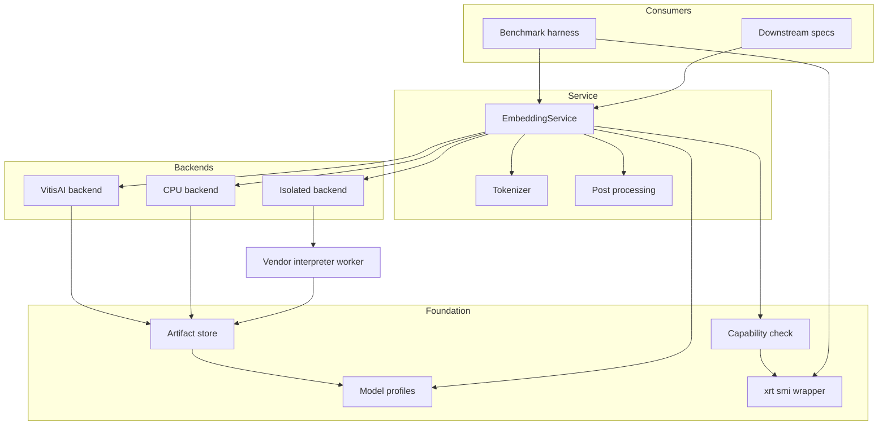
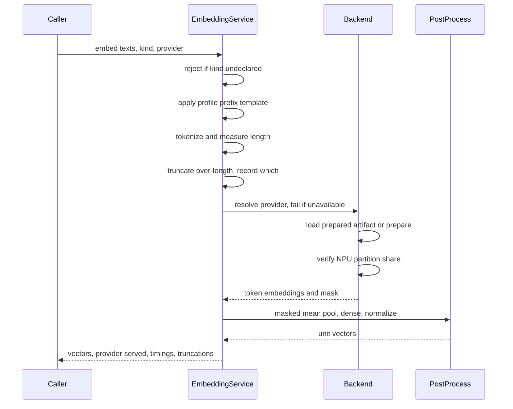
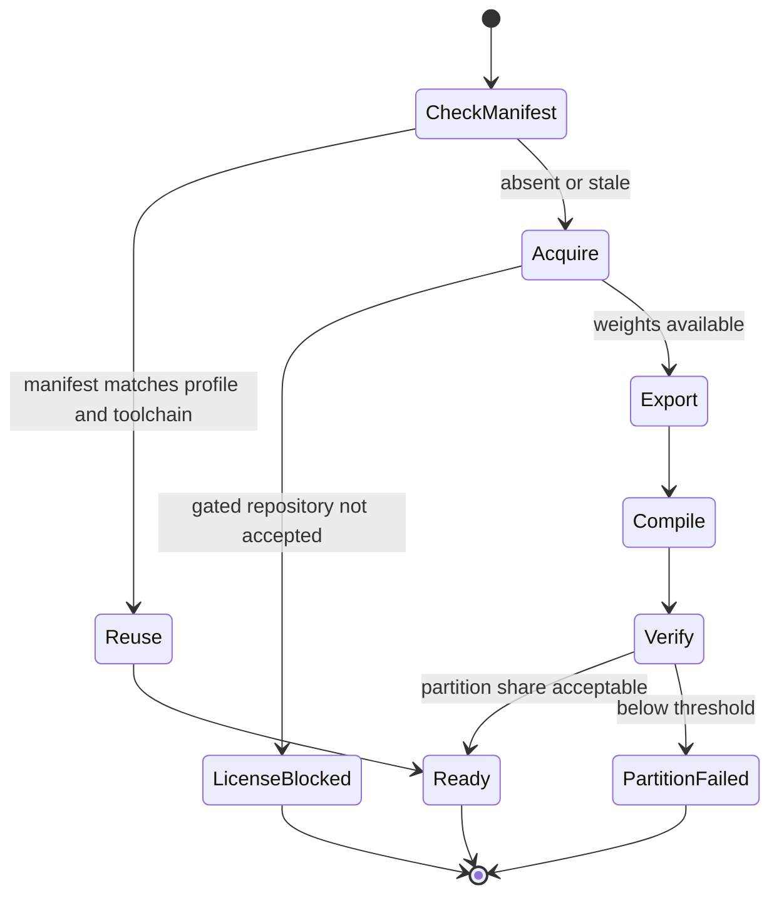

# Design Document: npu-embedding-runtime

## Overview

**Purpose**: This feature delivers NPU-accelerated text embedding to a local retrieval system, replacing hours of CPU load with minutes of low-power NPU execution, and proving the difference with measured evidence rather than assertion.

**Users**: The machine owner runs it indirectly through indexing and search; the three downstream specs consume it as a library. Its most demanding consumer is the benchmark, which exercises every backend under instrumentation.

**Impact**: Establishes the project's first executable code, its packaging baseline, and the contract — tokenizer, compiled sequence length, vector dimension — that `document-ingest` and `vector-index` build against.

The design turns on one discovery finding: the Vitis AI execution provider partitions a graph and silently runs unsupported subgraphs on the CPU *inside* a session that still reports itself as NPU-backed. A naive implementation would satisfy every acceptance criterion's letter while delivering the exact silent degradation Requirement 2 exists to prevent. Verification of partitioning, not session creation, is therefore load-bearing throughout.

### Goals

- Verify and report NPU environment readiness as discrete, individually legible conditions.
- Serve embeddings through one interface over explicitly selected backends, never falling back silently.
- Guarantee normalization and prefix handling identically across every backend by construction.
- Produce a written, reproducible benchmark that selects the default model on measured evidence.

### Non-Goals

- Chunking policy, tokenization boundaries for a corpus, or document parsing.
- Vector persistence, indexing, or search.
- Any command-line surface; `search-cli` exposes the benchmark later without reimplementing it.
- Reranking inference, language models, answer generation, integrated-GPU execution.

## Boundary Commitments

### This Spec Owns

- The entire `src/npu_rag/embedding/` package and everything under it.
- Environment capability detection and its verdict, including whether NPU execution is reachable in-process or only in isolation.
- Acquisition, ONNX export, NPU compilation, and artifact lifecycle for the three candidate models.
- The `EmbeddingService` contract: text in, unit-normalized vectors out, with declared text kind.
- The authoritative values of vector dimension, compiled sequence length, and the tokenizer.
- Provider selection semantics and provider reporting.
- The benchmark harness and the written benchmark document at `docs/embedding-benchmark.md`.
- Provisioning documentation at `docs/provisioning.md`.
- Creation of `pyproject.toml` with baseline project metadata and this feature's dependency group.

### Out of Boundary

- How a corpus is split into chunks. This spec publishes the compiled sequence length and the tokenizer; it does not consume documents.
- Storage, indexing, or retrieval of vectors. The benchmark's retrieval-quality measurement uses an in-memory comparison over a fixed sample, not a persistent index.
- **Text extraction from the source archive.** The benchmark does not read `.md` or `.pdf` files. It consumes a small pre-extracted fixture committed at `tests/fixtures/benchmark-corpus/`, generated once by an ad hoc script and thereafter treated as static test data. This keeps extraction wholly inside `document-ingest` and lets this spec be implemented in parallel with it, as the roadmap's wave 1 intends.
- Any CLI argument parsing, configuration file format, or environment-variable precedence. Callers pass explicit parameters.
- Installing the vendor runtime or upgrading the driver. This spec **detects and reports** environment state and documents the steps; it does not mutate the system.
- Cross-encoder reranking, and any component that would make this package depend on a vector store.

### Allowed Dependencies

- ONNX Runtime with the Vitis AI execution provider, obtained from **AMD's own package index at `https://pypi.amd.com/simple`** (`onnxruntime-vitisai`, `voe`) — not from PyPI, where `onnxruntime-vitisai` is absent and AMD's `voe` is a labelled dummy. Verified on this machine (2026-09-04): with `numpy<2` pinned and the `voe` wheel's mis-packaged DLL payload relocated (see research.md), the provider **registers and is selected in a pure uv-managed venv** — both guards pass. The environment is uv/venv only; conda is not installed and must not be assumed anywhere, including the isolated fallback, which — if ever needed — would be a second uv venv, not a conda env. Remaining gap: `vaiml.dll` (the BF16 compiler) is not shipped in these wheels, so the BF16 flow is unproven; sourcing it is the open item in task 1.3.
- The driver-level XRT tooling, which is **already present without the SDK** at `C:\Windows\System32\AMD` (`xrt-smi.exe`, `pyxrt.pyd`). Telemetry therefore does not depend on installing the Ryzen AI SDK.
- Hugging Face `transformers` / `tokenizers` for tokenization, `optimum` for ONNX export, `huggingface_hub` for gated acquisition.
- NumPy for post-processing and fidelity measurement.
- The vendor `xrt-smi` binary, invoked read-only as a subprocess.
- **Constraint**: this package must not import from any other `npu_rag` sub-package. The dependency direction runs outward from here; nothing upstream exists.

### Revalidation Triggers

Downstream specs must re-check integration when any of the following change:

- The compiled sequence length or vector dimension reported by a model profile — invalidates `document-ingest` chunk sizing and `vector-index` schema.
- The `TextKind` contract or prefix templates — changes embedding semantics without changing shapes, so it is undetectable by type checks.
- The tokenizer identity exposed for length measurement.
- The `EmbeddingService` method signatures or error taxonomy.
- The execution-mode verdict shifting between in-process and isolated — changes runtime prerequisites for `mcp-server`, which must hold a warm embedder.
- Addition of a dependency to `pyproject.toml`'s baseline group.

## Architecture

### Architecture Pattern & Boundary Map

**Selected pattern**: Ports and adapters. The `EmbeddingService` is the port; `VitisAIBackend`, `CpuBackend`, and `IsolatedBackend` are adapters behind one narrow protocol. Requirements 2.1 and 5.1 force this seam independently of style preference.



**Key decisions not visible in the diagram**:

- Post-processing sits on the service side of the port, so pooling, the Dense stage, and normalization execute identically no matter which adapter ran the transformer. This makes 3.5 structural and collapses 5.4's equivalence surface to the transformer alone.
- `Worker` is the only component that runs under a different Python interpreter. It reuses `Artifacts` and `Profiles` by importing this same package from the vendor environment, so there is one preparation implementation, not two.
- The benchmark reaches `XrtSmi` directly rather than through the service, because power sampling must run concurrently with — not inside — the measured call.

**Dependency direction** (each layer imports only from those to its left):

```
types, errors → reporting → profiles → environment → models → providers → service → bench
```

Violations are errors, not style issues. `providers` must never import `service`; `models` must never import `providers`.

### Technology Stack

| Layer | Choice / Version | Role in Feature | Notes |
|-------|------------------|-----------------|-------|
| Runtime | Python 3.12, `uv`-managed | Package and dependency management | `uvx` launchability is a downstream requirement this spec must not break |
| Inference | ONNX Runtime with Vitis AI EP (Ryzen AI 1.8) | NPU and CPU execution of the transformer | BF16 targeting on STX via a JSON `config_file` provider option |
| Model prep | `optimum` ONNX export, `transformers`, `tokenizers` | Export trunk to ONNX; tokenization | Export yields token embeddings only; pipeline stages applied separately |
| Numerics | NumPy | Masked mean pooling, Dense, normalization, fidelity comparison | Provider-independent by design |
| Telemetry | `xrt-smi` (vendor CLI, `C:\Windows\System32\AMD`) | NPU power sampling and partition occupancy | STX-only; reports estimated Watts, no utilization metric |
| Acquisition | `huggingface_hub` | Model download including gated repositories | EmbeddingGemma requires Gemma Terms acceptance |

## File Structure Plan

### Directory Structure

```
pyproject.toml                          # Baseline project metadata, this feature's dependency group
docs/
├── provisioning.md                     # Reproducible environment setup, verified versions
└── embedding-benchmark.md              # The written benchmark deliverable
benchmarks/                             # Raw measurement output, one directory per run
tests/fixtures/benchmark-corpus/
├── chunks.jsonl                        # Pre-extracted text sample, committed to the repo
└── relevance.jsonl                     # Query set with pre-identified relevant chunk ids
src/npu_rag/embedding/
├── __init__.py                         # Public surface, re-exports service and types only
├── types.py                            # TextKind, ProviderChoice, ExecutionMode, DocumentText, Condition, CapabilityReport
├── errors.py                           # Error taxonomy discriminating environment, preparation, execution
├── reporting.py                        # Progress callbacks, run summaries, provider attribution
├── profiles.py                         # The three ModelProfile entries and their prefix templates
├── environment/
│   ├── capability.py                   # Composes the capability report and the execution-mode verdict
│   └── xrt.py                          # xrt-smi subprocess wrapper, power and partition parsing
├── models/
│   ├── acquire.py                      # Model download, gated-license detection and reporting
│   ├── export.py                       # ONNX export at fixed sequence length and batch
│   └── artifacts.py                    # EP context compilation, manifest, staleness detection
├── providers/
│   ├── base.py                         # TransformerBackend protocol, backend resolution from ProviderChoice
│   ├── vitisai.py                      # NPU adapter, including partition verification
│   ├── cpu.py                          # CPU adapter, also the full-precision reference path
│   ├── isolated.py                     # Client side of the isolated adapter, framing protocol
│   └── worker.py                       # Worker entry point, runs under the vendor interpreter
├── tokenize.py                         # Tokenizer exposure and length measurement contract
├── postprocess.py                      # Masked mean pooling, Dense stage, L2 normalization
├── service.py                          # EmbeddingService, the port
└── bench/
    ├── harness.py                      # Orchestrates model x provider matrix, repetitions, variance
    ├── power.py                        # Energy sampler interface, xrt-smi implementation, unavailable case
    ├── fidelity.py                     # NPU vs full-precision CPU vector similarity
    ├── quality.py                       # Retrieval quality over a fixed query set and corpus sample
    └── report.py                       # Renders the benchmark document from recorded measurements
tests/embedding/                        # Mirrors the source layout
```

### Modified Files

None. This spec creates the repository's first source files.

> `worker.py` deliberately lives inside the package rather than as a standalone script: the vendor interpreter imports this same package, so preparation and profile logic exist once.

## System Flows

### Embedding a batch



The gating decisions are: kind must be declared before any work happens (3.2, 3.3); provider resolution fails before preparation rather than after (2.2); and partition verification happens after preparation but before the batch is accepted, so an under-partitioned model fails once rather than per batch.

### Preparation and artifact reuse



Staleness is decided by the sidecar manifest, not by file presence: a manifest recording a different compiled length, batch size, provider, or toolchain version invalidates the artifact even when the file loads cleanly (4.7). Partial writes are made invisible by writing to a temporary path and renaming only on success (8.5).

## Requirements Traceability

| Requirement | Summary | Components | Interfaces | Flows |
|-------------|---------|------------|------------|-------|
| 1.1, 1.2 | Capability check reports each condition individually | `environment/capability.py`, `environment/xrt.py` | `check_capability() -> CapabilityReport` | — |
| 1.3, 1.4 | Driver below minimum and runtime absent reported with remediation | `environment/capability.py` | `CapabilityReport.conditions` | — |
| 1.5 | Execution-mode verdict: in-process or isolated only | `environment/capability.py`, `providers/base.py` | `CapabilityReport.execution_mode` | Preparation |
| 1.6 | Reproducible provisioning documentation | `docs/provisioning.md` | — | — |
| 2.1 | Accept npu, cpu, auto | `types.py`, `providers/base.py` | `ProviderChoice`, `resolve_backend()` | Embedding |
| 2.2 | npu unavailable fails, never substitutes; unverifiable partitioning also fails under explicit npu | `providers/base.py`, `providers/vitisai.py` | `resolve_backend()` raises `NpuUnavailableError`; `PartitionShareTooLow` | Embedding |
| 2.3 | cpu forced regardless of NPU | `providers/cpu.py` | `resolve_backend()` | Embedding |
| 2.4, 2.5 | auto prefers NPU, reports reason on fallback | `providers/base.py`, `reporting.py` | `resolve_backend()`, `RunSummary.fallback_reason` | Embedding |
| 2.6 | Provider that served reported on success too | `reporting.py`, `service.py` | `EmbedResult.provider_served` | Embedding |
| 2.7 | No provider change mid-operation | `service.py` | Backend bound once per `embed()` call | Embedding |
| 3.1 | One vector per input, input order | `service.py` | `embed() -> EmbedResult` | Embedding |
| 3.2, 3.3 | Kind must be declared; reject if absent | `types.py`, `service.py` | `TextKind` required parameter | Embedding |
| 3.4 | Document and query conventions applied | `profiles.py`, `service.py` | `ModelProfile.document_template`, `.query_template` | Embedding |
| 3.5 | Unit-normalized vectors | `postprocess.py` | `finalize()` | Embedding |
| 3.6 | Report dimension and max input length | `profiles.py`, `service.py` | `EmbeddingService.contract()` | — |
| 3.7, 3.8 | Tokenizer exposed; consumer measurement agrees | `tokenize.py` | `EmbeddingService.tokenizer()`, `count_tokens()` | Embedding |
| 3.9 | Over-length input shortened and identified | `service.py`, `reporting.py` | `EmbedResult.truncated_indices` | Embedding |
| 3.10 | Same text twice yields identical vectors | `postprocess.py`, `providers/*` | Deterministic session options | Embedding |
| 4.1, 4.2 | Three candidates; EmbeddingGemma initial default | `profiles.py` | `PROFILES` mapping | — |
| 4.3, 4.4 | Artifacts persisted, reused, reuse reported | `models/artifacts.py` | `ensure_prepared() -> PreparedArtifact` | Preparation |
| 4.5 | Licensing requirement reported specifically | `models/acquire.py`, `errors.py` | `LicenseAcceptanceRequired` | Preparation |
| 4.6 | Failed preparation names the stage, no substitution | `models/artifacts.py`, `errors.py` | `PreparationError.stage` | Preparation |
| 4.7 | Artifacts invalid on version, length, or provider change | `models/artifacts.py` | `ArtifactManifest` comparison | Preparation |
| 5.1, 5.2 | Isolated mode; same requests, same criteria | `providers/isolated.py`, `providers/worker.py` | `TransformerBackend` protocol | Embedding |
| 5.3 | Isolated execution reported per operation | `reporting.py` | `EmbedResult.execution_mode` | Embedding |
| 5.4 | Isolated matches in-process within stated tolerance | `bench/fidelity.py` | `compare_backends()` | — |
| 5.5 | Worker failure reported, no unrequested provider change | `providers/isolated.py`, `errors.py` | `IsolatedWorkerError` | Embedding |
| 5.6 | Progress reported on the same terms | `reporting.py` | `ProgressCallback` | Embedding |
| 6.1, 6.2 | Model x provider matrix; throughput, latency, energy, memory, prep time | `bench/harness.py`, `bench/power.py` | `run_matrix() -> MatrixResult` | — |
| 6.3 | NPU vs full-precision CPU vector similarity | `bench/fidelity.py`, `providers/cpu.py` | `compare_to_reference()` | — |
| 6.4 | Retrieval quality on fixed query set | `bench/quality.py`, `tests/fixtures/benchmark-corpus/relevance.jsonl` | `score_retrieval()` | — |
| 6.5 | Representative corpus sample, size and composition stated | `bench/harness.py`, `tests/fixtures/benchmark-corpus/chunks.jsonl` | `SampleSpec` | — |
| 6.6 | Hardware, driver, runtime versions recorded | `bench/harness.py`, `environment/capability.py` | `RunContext` | — |
| 6.7 | Repetitions and observed variation reported | `bench/harness.py` | `MeasurementSeries` | — |
| 6.8 | Unmeasurable values recorded as omissions, never estimated | `bench/power.py`, `bench/report.py` | `Measurement.unavailable_reason` | — |
| 7.1, 7.7 | Document contains all measurements, NPU and CPU side by side | `bench/report.py` | `render_report()` | — |
| 7.2 | Methodology stated including sampling and repetitions | `bench/report.py` | `render_report()` | — |
| 7.3, 7.4 | Recommended default with reasoning and switch conditions | `bench/report.py` | `render_report()` | — |
| 7.5 | Versions recorded in the document | `bench/report.py` | `RunContext` | — |
| 7.6 | Incomplete models or measurements stated | `bench/report.py` | `Measurement.unavailable_reason` | — |
| 8.1, 8.2 | Failures name provider, model, stage; categories distinguished | `errors.py` | `EmbeddingRuntimeError` hierarchy | — |
| 8.3, 8.4 | Progress with completed and remaining; interruption reports completed | `reporting.py`, `service.py` | `ProgressCallback` | Embedding |
| 8.5 | No partial artifacts a later run would trust | `models/artifacts.py` | Temp-write then atomic rename | Preparation |
| 8.6 | Success reports elapsed time and count | `reporting.py` | `RunSummary` | Embedding |

## Components and Interfaces

| Component | Domain/Layer | Intent | Req Coverage | Key Dependencies (P0/P1) | Contracts |
|-----------|--------------|--------|--------------|--------------------------|-----------|
| `CapabilityChecker` | Environment | Report environment readiness and execution mode | 1.1–1.6, 6.6 | `xrt.py` (P1), ONNX Runtime (P0) | Service |
| `XrtSmiWrapper` | Environment | Read NPU power and partition occupancy | 1.1, 6.2, 6.8 | `xrt-smi` binary (P1) | Service |
| `ModelProfiles` | Foundation | Declare per-model behavior as data | 3.4, 3.6, 4.1, 4.2 | none | State |
| `ArtifactStore` | Models | Prepare, persist, validate, reuse compiled artifacts | 4.3–4.7, 8.5 | ONNX Runtime (P0), `optimum` (P0) | Service, Batch |
| `TransformerBackend` | Providers | Execute a prepared graph, return token embeddings | 2.1–2.7, 5.1–5.5 | `ArtifactStore` (P0) | Service |
| `EmbeddingService` | Service | The port: text to unit vectors with declared kind | 3.1–3.10, 2.6, 2.7, 8.3–8.6 | Backends (P0), `postprocess` (P0) | Service |
| `BenchmarkHarness` | Bench | Measure the matrix under instrumentation | 6.1–6.8 | `EmbeddingService` (P0), `power.py` (P1) | Batch |
| `BenchmarkReport` | Bench | Render the written deliverable | 7.1–7.7 | `BenchmarkHarness` (P0) | Batch |

### Environment

#### CapabilityChecker

| Field | Detail |
|-------|--------|
| Intent | Compose a per-condition environment report and decide the execution mode |
| Requirements | 1.1, 1.2, 1.3, 1.4, 1.5, 1.6, 6.6 |

**Responsibilities & Constraints**
- Evaluates each condition independently and never collapses them into one verdict (1.2).
- Is strictly read-only: detects and reports, never installs or modifies (Out of Boundary).
- Owns the execution-mode verdict that gates the isolated backend's existence (1.5).

**Dependencies**
- Outbound: `XrtSmiWrapper` — device identity and power support (P1)
- External: ONNX Runtime — `get_available_providers()` as the decisive in-process probe (P0)

**Contracts**: Service [x] / API [ ] / Event [ ] / Batch [ ] / State [ ]

##### Service Interface

```python
class ExecutionMode(StrEnum):
    IN_PROCESS = "in_process"
    ISOLATED = "isolated"
    UNAVAILABLE = "unavailable"

@dataclass(frozen=True)
class Condition:
    name: str
    satisfied: bool
    observed: str | None
    required: str | None
    remediation: str | None

@dataclass(frozen=True)
class CapabilityReport:
    conditions: tuple[Condition, ...]
    execution_mode: ExecutionMode
    driver_version: str | None
    runtime_version: str | None
    device_name: str | None
    power_reporting_supported: bool

def check_capability() -> CapabilityReport: ...
```

- Preconditions: none; must succeed on a machine with no NPU and no vendor runtime.
- Postconditions: every condition carries `observed`, `required`, and `remediation` when unsatisfied (1.3).
- Invariants: never raises for a missing environment — absence is data, not an exception.

**Implementation Notes**
- Integration: `RunContext` for 6.6 and 7.5 is built from this report, so version provenance has one source.
- Validation: conditions cover NPU device presence, vendor runtime installation, driver minimum, EP registration, and required environment variables.
- Risks: driver version schemes are not directly comparable. Measured on this machine, XRT self-reports `NPU Driver Version: 32.0.20102.3930` (XRT 2.21.0, firmware 1.1.2.64, hash dated 2026-05-07), while the 1.8 docs state a minimum of `32.0.203.280`. The third component differs in width (`20102` versus `203`), so these are plausibly different numbering branches rather than an old-versus-new pair — and component-wise the installed value is the larger. **The design must not assert the driver is too old.** The checker reports observed and documented-required values side by side and defers the adequacy verdict to whether the provider actually registers, which is the only reliable evidence.

### Providers

#### TransformerBackend

| Field | Detail |
|-------|--------|
| Intent | Execute a prepared graph and return token embeddings, nothing more |
| Requirements | 2.1, 2.2, 2.3, 2.4, 2.5, 2.7, 5.1, 5.2, 5.5 |

**Responsibilities & Constraints**
- Returns **token** embeddings plus the attention mask. It never pools, never normalizes — that belongs to the service so it cannot differ per backend.
- **Provider identity must be guarded twice, because session creation is not a signal.** Measured on this machine: constructing a session with `providers=["VitisAIExecutionProvider"]` when the EP is absent **succeeds**, emits only a `UserWarning`, and runs the graph on the CPU. Supplying `provider_options` does not change this. A `try`/`except` around session construction detects nothing. The two guards are therefore mandatory:
  1. **Pre-check** `get_available_providers()` contains the requested provider before constructing anything.
  2. **Post-check** `session.get_providers()[0]` equals the requested provider after construction.
  Only then does partition-share verification apply, as a third and finer check.
- **Partition share must be read from the right artifact, and two of the obvious ones lie.** Measured 2026-09-05 on a graph the compiler could not offload at all:
  - The console line `100.00% of operations will run on AIE` — **misleading**, it reports a fail-safe partition *plan*, not a support verdict.
  - `<cache>/<key>/vaiml_partition_fe.flexml/fail_safe_summary.json` → `{"AIE": 100, "CPU": 0}` — **misleading for the same reason**.
  - `<cache>/<key>/preliminary-vaiml-pass-summary.txt` → `Number of operators supported by VAIML: 0(0.000%)` — **authoritative**. This is the file the partition check must parse; it also states `Model data type` and `Device data type`, confirming whether BF16 targeting actually engaged.
  A fourth, independent signal is throughput A/B against a CPU-only session on the identical graph: a ratio inside roughly 0.85–1.15 means the NPU is not doing the work regardless of what any log claims.
- `VitisAIBackend` verifies the NPU partition share after preparation and rejects the backend when it falls below threshold under an explicit `npu` selection.
- **Precision is a property of the backend, not the export.** The exported `model.onnx` is FP32; BF16 targeting happens at session construction through the Vitis AI `config_file` option, so the EP performs the cast. `CpuBackend` therefore executes the same graph at full precision and is the natural reference for 6.3 — the two backends differ in numeric precision alone, which is exactly what that measurement isolates.
- `IsolatedBackend` is implemented **only if** `CapabilityChecker` reports `ISOLATED`; its protocol is specified here so that decision costs no redesign.

**Dependencies**
- Outbound: `ArtifactStore` — prepared graph (P0)
- External: ONNX Runtime session (P0); loopback socket and vendor interpreter for the isolated adapter (P1)

**Contracts**: Service [x] / API [ ] / Event [ ] / Batch [ ] / State [ ]

##### Service Interface

```python
class TransformerBackend(Protocol):
    @property
    def provider(self) -> ProviderChoice: ...
    @property
    def execution_mode(self) -> ExecutionMode: ...
    @property
    def npu_partition_share(self) -> float | None: ...

    def run(
        self,
        token_ids: npt.NDArray[np.int64],
        attention_mask: npt.NDArray[np.int64],
    ) -> npt.NDArray[np.float32]: ...

def resolve_backend(
    choice: ProviderChoice,
    profile: ModelProfile,
    capability: CapabilityReport,
) -> tuple[TransformerBackend, str | None]: ...
```

- Preconditions: `token_ids` and `attention_mask` are shaped `(batch, compiled_seq_len)`; partial batches are padded by the caller.
- Postconditions: returns `(batch, compiled_seq_len, hidden)`; `resolve_backend` returns the fallback reason as the second element, non-`None` only under `auto` (2.5).
- Invariants: `resolve_backend` raises rather than substituting when `choice` is `NPU` and the NPU is unusable (2.2); a resolved backend is bound for the whole operation (2.7).

##### Isolated adapter framing

- Trigger: one request frame per batch over a loopback socket.
- Payload: 4-byte big-endian length, then a JSON header (`shape`, `dtype`, `request_id`), then a raw `float32` or `int64` payload.
- Delivery: synchronous request-response; no pickle, so the two interpreters need not match.
- Idempotency: `request_id` echoed in the response; a mismatched id is a protocol error, not a retry.

**Implementation Notes**
- Integration: the worker imports this same package under the vendor interpreter, so `ArtifactStore` and `ModelProfiles` have exactly one implementation.
- Validation: 5.4 expects **bitwise-identical** vectors, since the ONNX graph and post-processing are shared; any divergence is a defect, and the stated tolerance exists to document that expectation rather than to excuse drift.
- Risks: partition-share diagnostics are not a stable contract, so the design must tolerate their absence — but **the tolerance policy depends on the provider choice, not on the diagnostics alone**:
  - Under explicit `NPU`, unverifiable partitioning is a **failure** (`PartitionShareTooLow` with an "unverifiable" cause). The caller demanded the NPU; proceeding without evidence would reintroduce precisely the silent degradation Requirement 2 exists to prevent (2.2).
  - Under `AUTO`, unverifiable partitioning is a recorded warning and execution proceeds, since the caller has already accepted provider substitution.
  - Either way `EmbedResult.partition_verified` reports whether verification actually happened, so a caller or the benchmark can distinguish "verified on NPU" from "assumed on NPU" (2.6).

### Service

#### EmbeddingService

| Field | Detail |
|-------|--------|
| Intent | Turn declared-kind text into unit-normalized vectors and report what happened |
| Requirements | 3.1–3.10, 2.6, 2.7, 5.3, 5.6, 8.3, 8.4, 8.6 |

**Responsibilities & Constraints**
- Requires `TextKind` on every call and rejects requests that omit it, before any work (3.2, 3.3).
- Applies the profile's template — for documents this includes a **title slot**, not a bare prefix (3.4).
- Owns truncation and its reporting; the reported maximum is the **compiled** length, never the model's architectural limit (3.6, 3.9).
- Reports the serving provider on success as well as failure (2.6).

**Dependencies**
- Outbound: `resolve_backend` (P0), `postprocess.finalize` (P0), `ModelProfiles` (P0), `tokenize` (P0)

**Contracts**: Service [x] / API [ ] / Event [ ] / Batch [ ] / State [ ]

##### Service Interface

```python
class TextKind(StrEnum):
    DOCUMENT = "document"
    QUERY = "query"

@dataclass(frozen=True)
class DocumentText:
    content: str
    title: str | None = None

@dataclass(frozen=True)
class EmbeddingContract:
    model_id: str
    dimension: int
    max_input_tokens: int          # the compiled length, not the architectural limit
    tokenizer_id: str

@dataclass(frozen=True)
class EmbedResult:
    vectors: npt.NDArray[np.float32]
    provider_served: ProviderChoice
    execution_mode: ExecutionMode
    partition_verified: bool | None   # None when the provider was CPU; False means assumed, not verified
    fallback_reason: str | None
    truncated_indices: tuple[int, ...]
    elapsed_seconds: float
    input_count: int

class EmbeddingService:
    def contract(self) -> EmbeddingContract: ...
    def tokenizer(self) -> PreTrainedTokenizerBase: ...
    def count_tokens(self, text: str, kind: TextKind) -> int: ...
    def embed_documents(
        self, texts: Sequence[DocumentText], provider: ProviderChoice,
        progress: ProgressCallback | None = None,
    ) -> EmbedResult: ...
    def embed_queries(
        self, texts: Sequence[str], provider: ProviderChoice,
        progress: ProgressCallback | None = None,
    ) -> EmbedResult: ...
```

- Preconditions: non-empty input; a provider choice is always explicit, with no default.
- Postconditions: `len(vectors) == len(texts)` in input order (3.1); every row is unit-norm within floating-point tolerance (3.5); `count_tokens` agrees with the truncation decision for the same text and kind (3.8).
- Invariants: identical text, model, and provider yield identical vectors (3.10); no separate benchmark path exists, so measured behavior is production behavior.

**Implementation Notes**
- Integration: separate `embed_documents` and `embed_queries` methods rather than a `kind` argument — this makes 3.3 a type error at the call site instead of a runtime rejection, and `DocumentText` carries the title slot that a bare string cannot.
- Validation: 3.8's contract is tested by asserting that `count_tokens` and the internal truncation decision agree across a corpus sample, not by asserting a number.
- Risks: a missing Dense stage produces correctly shaped, correctly normalized, semantically wrong vectors. Only the retrieval-quality measurement (6.4) detects this; shape and norm assertions cannot.

### Benchmark

#### BenchmarkHarness and BenchmarkReport

| Field | Detail |
|-------|--------|
| Intent | Measure the model-by-provider matrix and render the written deliverable |
| Requirements | 6.1–6.8, 7.1–7.7 |

**Responsibilities & Constraints**
- Consumes `EmbeddingService` as an ordinary caller. No privileged access, so the measured path is the production path.
- Samples power concurrently with the measured call, never inside it.
- Records omissions as first-class values; a missing measurement is never estimated or substituted (6.8, 7.6).

**Dependencies**
- Outbound: `EmbeddingService` (P0), `XrtSmiWrapper` (P1)
- External: `xrt-smi` polling for NPU Watts (P1)

**Contracts**: Service [ ] / API [ ] / Event [ ] / Batch [x] / State [ ]

##### Batch Contract

- Trigger: explicit invocation with a `SampleSpec` and a repetition count.
- Input: a stated corpus sample plus a fixed query set with pre-identified relevant results; the sample's size and composition are recorded (6.5).
- Output: `MatrixResult` persisted under `benchmarks/<run-id>/`, rendered to `docs/embedding-benchmark.md` (7.1).
- Idempotency & recovery: each run writes a new directory; a failed cell records its failure and the matrix continues, so one unusable model does not void the run.

##### Energy sampling

```python
@dataclass(frozen=True)
class Measurement:
    value: float | None
    unit: str
    unavailable_reason: str | None   # non-None exactly when value is None

class PowerSampler(Protocol):
    def supported(self) -> bool: ...
    def sample_watts(self) -> float | None: ...
```

- NPU energy is the time-integral of polled Watts over wall-clock, not a hardware energy counter. The sampling interval and integration method are stated in the methodology (7.2).
- **CPU-provider energy has no equivalent source.** `xrt-smi` reports NPU power only. For CPU rows, energy is recorded as unavailable with that reason (6.8), while throughput, latency, and wall-clock remain directly comparable (7.7).

**Implementation Notes**
- Integration: `search-cli` later invokes `run_matrix` and `render_report` directly; the harness must not assume a terminal.
- Validation: 6.7 requires more than one repetition per cell with reported variation, which also exposes thermal drift on a passively cooled handheld.
- Risks: polled sampling understates short bursts. Stated as a methodology limitation rather than corrected, because correcting it would mean estimating.

## Data Models

### Domain Model

- **ModelProfile** (value object, aggregate root for model behavior) — invariant: `compiled_seq_len` and `batch_size` are fixed at export and must equal the values recorded in any artifact manifest claiming to serve this profile.
- **ArtifactManifest** (entity, keyed by model id + provider + compiled length) — invariant: an artifact is valid only when every manifest field matches the current profile and toolchain.
- **CapabilityReport** (value object) — invariant: `execution_mode` is `IN_PROCESS` only when EP registration succeeded in this interpreter.
- **Measurement** (value object) — invariant: exactly one of `value` and `unavailable_reason` is set.

```python
@dataclass(frozen=True)
class ModelProfile:
    model_id: str
    dimension: int
    compiled_seq_len: int        # 512 by default; the value published as max_input_tokens
    batch_size: int
    pooling: Literal["mean"]
    has_dense_stage: bool
    architectural_context_limit: int  # the model's own limit; deliberately NOT what 3.6 publishes
    document_template: str       # e.g. 'title: {title} | text: {content}'
    query_template: str          # e.g. 'task: search result | query: {content}'
    license_gated: bool
    license_acceptance_url: str | None  # required when gated: LicenseAcceptanceRequired has no default
```

### Physical Data Model

Artifacts live on the filesystem, not in a database:

```
artifacts/<model-id>/<provider>/<compiled-seq-len>/
├── model.onnx              # exported trunk
├── context.onnx            # EP context snapshot, NPU only
├── dense.npz               # Dense stage weights, when has_dense_stage
└── manifest.json           # identity and invalidation key
```

`manifest.json` records model id and revision, compiled sequence length, batch size, provider, Ryzen AI runtime version, driver version, ONNX Runtime version, and the observed NPU partition share. Comparison against the current profile and toolchain decides reuse versus rebuild (4.4, 4.7). Writes go to a sibling temporary directory and are renamed on success, so an interrupted preparation leaves nothing a later run would trust (8.5).

## Error Handling

### Error Strategy

Fail fast at the boundary, and make the category structural so 8.2 is satisfied by the type rather than by message text.

```python
class EmbeddingRuntimeError(Exception):
    provider: ProviderChoice | None
    model_id: str | None
    stage: str

class EnvironmentError_(EmbeddingRuntimeError): ...     # NPU absent, runtime missing, driver too old
class NpuUnavailableError(EnvironmentError_): ...       # raised under explicit npu selection
class PreparationError(EmbeddingRuntimeError): ...      # acquisition, export, compile, verify
class LicenseAcceptanceRequired(PreparationError): ...   # gated repository, carries acceptance URL
class PartitionShareTooLow(PreparationError): ...        # graph largely assigned to CPU
class ExecutionError(EmbeddingRuntimeError): ...        # session run failures
class IsolatedWorkerError(ExecutionError): ...          # worker absent, failed to start, died
```

Every error carries provider, model, and stage (8.1). The three top categories map one-to-one onto 8.2's required distinction.

### Error Categories and Responses

- **Environment**: report observed versus required with remediation; never attempt repair (1.3, 1.4).
- **Preparation**: name the failing stage; never substitute a different model or provider (4.6). `LicenseAcceptanceRequired` is raised specifically rather than surfacing as a generic download failure (4.5).
- **Execution**: report completed count on interruption (8.4); a dead isolated worker does not silently promote another provider (5.5).

### Monitoring

Progress is a callback, not logging, so callers choose presentation (5.6, 8.3). Every completed operation emits elapsed time, input count, provider served, execution mode, and truncation count (2.6, 8.6).

## Testing Strategy

### Unit Tests

- `postprocess.finalize` produces unit-norm rows and honors the attention mask under fixed-length padding, verified against a hand-computed reference — the padding-mask interaction is where mean pooling silently breaks (3.5).
- `ArtifactManifest` comparison invalidates on each of model revision, compiled length, batch size, provider, and toolchain version independently (4.7).
- `resolve_backend` raises `NpuUnavailableError` under `npu` with an unavailable NPU, and returns a non-`None` fallback reason under `auto` (2.2, 2.5).
- Driver version comparison parses and orders vendor version strings component-wise, including the observed `32.0.20102.3930` versus required `32.0.203.280` case (1.3).
- `Measurement` rejects construction with both `value` and `unavailable_reason` set, or neither (6.8).

### Integration Tests

- `count_tokens` agrees with the service's truncation decision across a corpus sample, establishing the 3.8 contract that `document-ingest` depends on.
- Preparation interrupted mid-write leaves no artifact directory a subsequent run accepts as valid (8.5).
- A second `embed_documents` call reuses artifacts and reports reuse, with preparation time near zero (4.3, 4.4).
- Isolated and in-process backends return identical vectors for the same inputs, given a shared graph and shared post-processing (5.2, 5.4).
- Gated-model acquisition without accepted terms raises `LicenseAcceptanceRequired` carrying the acceptance step, not a transport error (4.5).

### End-to-End Paths

- **The gating spike**: from a `uv`-managed environment, prepare and run one model on the NPU and confirm EP registration plus partition share. This determines whether the isolated backend is built at all (1.5).
- **Full benchmark run**: three models across NPU and CPU, producing `docs/embedding-benchmark.md` with every measurement, stated omissions, methodology, and a reasoned default (6.1–6.8, 7.1–7.7).
- **Explicit-provider contract**: `--provider npu` on a machine with the NPU disabled fails without producing vectors, proving no silent fallback exists (2.2).

### Performance

- Throughput measured in inputs per second per model per provider; the NPU-versus-CPU ratio is the project's central claim (6.2).
- Energy per 1,000 inputs on the NPU; recorded as unavailable with reason for CPU (6.2, 6.8).
- First-run versus warm preparation time, establishing that artifact reuse is worth its lifecycle complexity (6.2, 4.4).
- Padding overhead at `compiled_seq_len` 512 for short chunks, since every input costs a full-length pass regardless of content.

## Security Considerations

- Model weights are downloaded from Hugging Face; acquisition records model revision in the manifest so a silently changed upstream artifact is detectable.
- The isolated backend binds a **loopback** socket only, and the framing protocol carries no executable content — no pickle, so a malformed frame cannot execute code.
- `xrt-smi` is invoked with a fixed argument vector and never with shell interpolation.
- EmbeddingGemma is redistribution-restricted under the Gemma Terms of Use; artifacts stay local and are never bundled into a distributable package.

## Open Questions / Risks

- **Whether the EP registers in a `uv` environment is unresolved upstream.** The spike answers it before anything depends on the answer; the isolated backend is designed and costed but built only if needed.
- **Partition-share diagnostics have no stable format.** The check degrades to a warning if diagnostics change shape, so it cannot become a blocker.
- **CPU energy is unmeasurable with the available tooling**, making the headline energy comparison one-sided. Throughput and wall-clock carry the comparison; the gap is stated, not estimated.
- **`compiled_seq_len` of 512 is an assumption.** If padding overhead dominates for short chunks, a 256 profile may be warranted — a benchmark output, not a design commitment.
- **The isolated worker's deployment is deliberately unspecified, pending the spike — and after the 2026-09-04 probe it is probably moot.** The provider registers and is selected in a pure uv venv, so the in-process path works; the worker would only return if the BF16 flow (`vaiml.dll`) turns out to demand a different environment. If it is ever built, it runs under a **second uv-managed venv** — never conda, which is not installed on this machine and is excluded by user directive. Specifying it now would detail a path the spike may prove unnecessary. If the capability check reports `ISOLATED`, this must be resolved before the isolated backend is built, and the resolution must include a **version handshake in the first frame** so a mismatched worker fails loudly rather than returning subtly wrong vectors. Raised as Critical Issue 2 in design validation and accepted as deferred.
